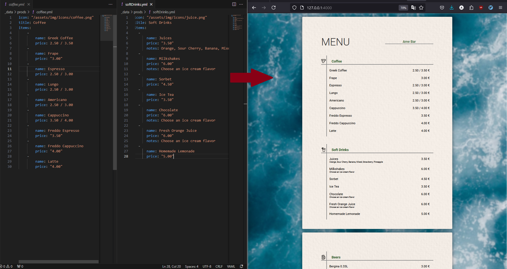

# A Simple Digital Menu
A simple digital meny to use with QR code. An easy way to upgrade products and categories for the menu

# How to install

### Windows

1. Install 'ruby' from [here](https://rubyinstaller.org/)

2. `git clone`

2. Run `bundle install`

# How to start

1. Inside the folder AMEBAR run `jekyll serve --host=<your local ip>` 

# More
Inside the _data is the structure for the products there you can add or remove products or categories.

Page layout and products categories sequence change through layout.
